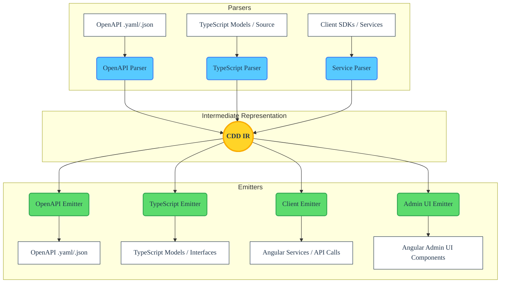

# cdd-web-ng Architecture

<!-- BADGES_START -->
<!-- Replace these placeholders with your repository-specific badges -->

<!-- BADGES_END -->

The **cdd-web-ng** tool acts as a dedicated compiler and transpiler. Its fundamental architecture follows standard compiler design principles, divided into three distinct phases: **Frontend (Parsing)**, **Intermediate Representation (IR)**, and **Backend (Emitting)**.

This decoupled design ensures that any format capable of being parsed into the IR can subsequently be emitted into any supported output format, whether that is a client-side SDK, an administrative UI component, or an OpenAPI specification.

## 🏗 High-Level Overview

## 🧩 Core Components

### 1. The Frontend (Parsers)

The Frontend's responsibility is to read an input source and translate it into the universal CDD Intermediate Representation (IR).

- **Static Analysis (AST-Driven)**: For `TypeScript (Angular)` source code, the tool **does not** use dynamic reflection or execute the code. Instead, it reads the source files, generates an Abstract Syntax Tree (AST) utilizing `ts-morph`, and navigates the tree to extract classes, interfaces, client methods, type signatures, and docstrings.
- **OpenAPI Parsing**: For OpenAPI and JSON Schema inputs, the parser normalizes the structure, resolving internal `$ref`s and extracting properties, endpoints (from a client perspective), and metadata into the IR.

### 2. Intermediate Representation (IR)

The Intermediate Representation is the crucial "glue" of the architecture. It is a normalized, language-agnostic data structure that represents concepts like:

- **Models**: Entities containing typed properties, required fields, defaults, and descriptions.
- **Endpoints / Operations**: HTTP verbs, paths, path/query/body parameters, and responses. In the IR, an operation is an abstract concept that can represent an API Client dispatching a request or an Admin UI component interacting with a resource.
- **Metadata**: Tooling hints, docstrings, and validations.

By standardizing on a single IR (heavily inspired by OpenAPI / JSON Schema primitives), the system guarantees that parsing logic and emitting logic remain completely decoupled.

### 3. The Backend (Emitters)

The Backend's responsibility is to take the universal IR and generate valid target output. `cdd-web-ng` focuses specifically on front-end code generation targeting the Angular framework (with extendable structure for others like React and Vue).

- **Code Generation**: Emitters iterate over the IR and generate idiomatic `TypeScript (Angular)` source code.
    - A **Client Emitter** creates Angular API service wrappers, fetch functions using `HttpClient`, and response-parsing logic.
    - An **Admin UI Emitter** translates the IR into robust Angular components (forms, lists) for resource management.
    - A **Model Emitter** creates TypeScript interfaces or classes matching the schema definitions.
- **Specification Generation**: Emitters translating back to OpenAPI serialize the IR into standard OpenAPI 3.x JSON or YAML, rigorously formatting descriptions, type constraints, and endpoint schemas based on what was parsed from the source code.

## 🔄 Extensibility

Because of the IR-centric design, adding support for a new output format requires minimal effort:

1. **To support parsing a new source**: Write a parser that converts the target AST/DSL into the CDD IR. Once written, the source can automatically be exported to OpenAPI, Client SDKs, or Admin UIs.
2. **To support emitting a new framework**: Write an emitter that converts the CDD IR into the framework's DSL/AST. Once written, the framework can automatically be generated from OpenAPI.

## 🛡 Design Principles

1. **A Single Source of Truth**: Developers should be able to maintain their definitions in whichever format is most ergonomic for their team (OpenAPI files, Native Code, Client libraries) and generate the rest.
2. **Zero-Execution Parsing**: Ensure security and resilience by strictly statically analyzing inputs. The compiler must never need to run the target code to understand its structure.
3. **Lossless Conversion**: Maximize the retention of metadata (e.g., type annotations, docstrings, default values, validators) during the transition `Source -> IR -> Target`.
4. **Symmetric Operations**: An Endpoint in the IR holds all the information necessary to generate both the Client-side SDK method that calls it, and accurately reconstruct the OpenAPI path item that defined it.
