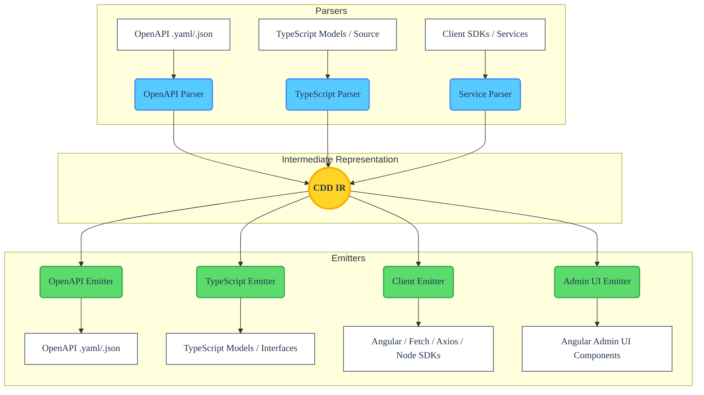

# cdd-web-ng Architecture

<!-- BADGES_START -->
<!-- Replace these placeholders with your repository-specific badges -->

<!-- BADGES_END -->

The **cdd-web-ng** tool acts as a dedicated compiler and transpiler. Its fundamental architecture follows standard compiler design principles, divided into three distinct phases: **Frontend (Parsing)**, **Intermediate Representation (IR)**, and **Backend (Emitting)**.

This decoupled design ensures that any format capable of being parsed into the IR can subsequently be emitted into any supported output transport mechanism, whether that is a browser-native SDK, an administrative UI component, or an OpenAPI specification.

## 🏗 High-Level Overview

## 🧩 Core Components

### 1. The Frontend (Parsers)

The Frontend's responsibility is to read an input source and translate it into the universal CDD Intermediate Representation (IR).

- **Static Analysis (AST-Driven)**: For TypeScript source code, the tool **does not** use dynamic reflection or execute the code. Instead, it reads the source files, generates an Abstract Syntax Tree (AST) utilizing `ts-morph`, and navigates the tree to extract classes, interfaces, client methods, type signatures, and docstrings.
- **OpenAPI Parsing**: For OpenAPI and JSON Schema inputs, `SwaggerParser` normalizes the structure, resolving internal `$ref`s and extracting properties, endpoints, and metadata into the IR.

### 2. Intermediate Representation (IR)

The Intermediate Representation is the crucial "glue" of the architecture. It is a normalized, language-agnostic data structure managed primarily by `ServiceMethodAnalyzer`. It translates raw OpenAPI into:

- **Models**: Entities containing typed properties, required fields, defaults, and descriptions.
- **Endpoints / Operations (`ServiceMethodModel`)**: HTTP verbs, paths, path/query/body parameters, serialization strategies, and response variants.
- **Metadata**: Tooling hints, docstrings, and validations.

By standardizing on a single IR, the system guarantees that parsing logic and emitting logic remain completely decoupled.

### 3. The Backend (Emitters)

The Backend's responsibility is to take the universal IR and generate valid target output. `cdd-web-ng` focuses specifically on front-end and backend Node.js code generation targeting multiple transports via a Plugin Architecture.

- **`AbstractClientGenerator`**: The base orchestrator that defines the pipeline (generate models -> generate utilities -> generate services).
- **Vendor Plugins**:
    - **`AngularClientGenerator`**: Emits RxJS-based `HttpClient` code and `NgModule`s.
    - **`FetchClientGenerator`**: Emits Promise-based native browser `fetch` code.
    - **`AxiosClientGenerator`**: Emits Promise-based `axios` configurations and requests.
    - **`NodeClientGenerator`**: Emits Promise-based `node:http/https` chunks and streams.
- **Admin UI Emitter**: An optional plugin (currently Angular-only) that translates the IR into robust components (forms, lists) for resource management.

## 🔄 Extensibility

Because of the IR-centric design, adding support for a new output format (e.g. `React`, `Vue`) requires minimal effort:

1. Create a class extending `AbstractClientGenerator`.
2. Implement an `AbstractServiceGenerator` to manage the output files.
3. Use the `ServiceMethodAnalyzer` to iterate over endpoints, mapping the IR properties (like `urlTemplate`, `queryParams`, `body`) to your target framework's specific AST nodes using `ts-morph`.

## 🛡 Design Principles

1. **A Single Source of Truth**: Developers should be able to maintain their definitions in whichever format is most ergonomic for their team (OpenAPI files, Native Code, Client libraries) and generate the rest.
2. **Zero-Execution Parsing**: Ensure security and resilience by strictly statically analyzing inputs. The compiler must never need to run the target code to understand its structure.
3. **Lossless Conversion**: Maximize the retention of metadata (e.g., type annotations, docstrings, default values, validators) during the transition `Source -> IR -> Target`.
4. **Symmetric Operations**: An Endpoint in the IR holds all the information necessary to generate both the Client-side SDK method that calls it, and accurately reconstruct the OpenAPI path item that defined it.
