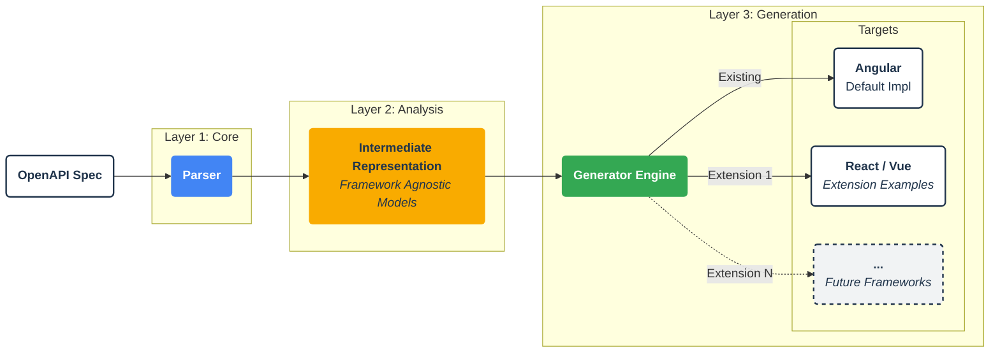
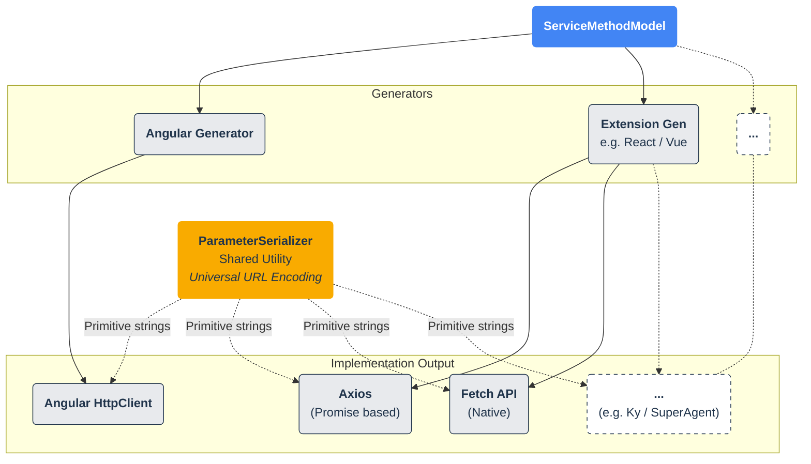

Guide to Extending the Code Generator
=====================================

This document provides detailed instructions on how to extend the `cdd-web-ng` generator to support new frameworks (
like [React](https://react.dev) and [Vue](https://vuejs.org)) and integrate different HTTP clients (
like [Axios](https://axios-http.com) or [Fetch API](https://developer.mozilla.org/en-US/docs/Web/API/Fetch_API)).

## Architectural Overview

The generator is built on a clean, three-layer architecture designed for maximum extensibility. The system is not
limited to Angular; it acts as an engine that consumes an OpenAPI specification and outputs code for any target
framework (React, Vue, Svelte, etc.).



### The Three Layers

1. **Core Layer (`src/core`)**: Responsible for parsing the OpenAPI specification. This layer handles resolving
   references (`$ref`), extracting paths, and validating the input. It is completely framework-agnostic and should
   rarely need modification.

2. **Analysis / IR Layer (`src/analysis`)**: This is the "brain" of the generator. It analyzes the parsed specification
   and converts it into a highly abstracted **Intermediate Representation (IR)**.
    * `ServiceMethodModel`: Describes *what* an API call looks like (inputs, outputs, serialization rules) without
      specifying *how* to call it.
    * `FormAnalysisResult`: Describes a form's structure (groups, arrays, validation rules) without coupling to Angular
      Forms or React Hook Form.
    * `ListViewModel`: Describes a data table structure.
    * **Key Takeaway**: This layer decouples the "What" from the "How". It is reusable across *all* target frameworks.

   *Visualizing how the Form IR is translated:*

   ```mermaid
   graph TD
   %% --- TOP ---
   FormIR(<strong>FormAnalysisResult</strong><br/>Agnostic Schema Definition)

   %% --- MIDDLE: GENERATORS ---
   subgraph Strategies [Generation Strategies]
       direction LR
       
       ReactStrategy(<strong>React Generator</strong><br/>e.g. React Hook Form)
       AngStrategy(<strong>Angular Generator</strong><br/>e.g. Reactive Forms)
       OtherStrategy(<strong>...</strong><br/>e.g. Vue / Svelte)
   end

   %% --- BOTTOM: OUTPUT ---
   subgraph Result [Final Code]
       direction LR
       
       R_Comp(<strong>React Component</strong>)
       A_Comp(<strong>Angular Component</strong>)
       O_Comp(<strong>...</strong>)
   end

   %% --- EDGES ---
   FormIR --> ReactStrategy
   FormIR --> AngStrategy
   FormIR -.-> OtherStrategy

   ReactStrategy --> R_Comp
   AngStrategy --> A_Comp
   OtherStrategy -.-> O_Comp

   %% --- STYLING ---
   classDef analysis fill:#34a853,color:#ffffff,stroke:#20344b,stroke-width:0px
   classDef gen fill:#4285f4,color:#ffffff,stroke:#20344b,stroke-width:0px
   classDef output fill:#ffffff,color:#20344b,stroke:#20344b,stroke-width:2px
   classDef future fill:#ffffff,stroke:#20344b,color:#20344b,stroke-width:2px,stroke-dasharray: 5 5

   class FormIR analysis
   class ReactStrategy,AngStrategy gen
   class R_Comp,A_Comp output
   class OtherStrategy,O_Comp future
   ```

3. **Generation Layer (`src/generators`)**: Consumes the IR and emits framework-specific strings (TypeScript, HTML,
   CSS). All framework-specific logic (Angular Services, React Hooks, Vue Composables) lives exclusively here.

To add support for a new technology, you will work almost entirely within the **Generation Layer**.

---

## How to Add a New Framework (e.g., React)

Adding a new framework like React involves creating a new set of generators that iterate over the existing IR models and
emit React-specific code.

### 1. Create the Framework Directory

Create a dedicated directory structure for your framework inside `src/generators`.

```txt
src/generators/
├── angular/       <-- Existing Angular Logic
└── react/         <-- YOUR NEW FOLDER
    ├── react-client.generator.ts  <-- Main Entry Point
    ├── service/
    │   └── axios-service.generator.ts
    └── admin/     <-- Optional Admin Generators
```

### 2. Implement the Main Client Generator

Create `src/generators/react/react-client.generator.ts`. This orchestrator implements the `IClientGenerator` interface.
It is responsible for calling all sub-generators required for a complete React client.

```typescript
// src/generators/react/react-client.generator.ts

import { Project } from 'ts-morph';
import { SwaggerParser } from '@src/core/parser.js';
import { GeneratorConfig } from '@src/core/types/index.js';
import { AbstractClientGenerator } from '../../core/generator.js';

// 1. REUSE SHARED GENERATORS
import { TypeGenerator } from '../shared/type.generator.js';
import { ParameterSerializerGenerator } from '../shared/parameter-serializer.generator.js';

// 2. IMPORT YOUR NEW GENERATORS
import { ReactAxiosGenerator } from './service/axios-service.generator.js';

export class ReactClientGenerator extends AbstractClientGenerator {
    public async generate(project: Project, parser: SwaggerParser, config: GeneratorConfig, outputDir: string): Promise<void> {

        // Step 1: Generate Models (Reusable!)
        // The TypeGenerator creates pure TypeScript interfaces found in /models
        new TypeGenerator(parser, project, config).generate(outputDir);
        console.log('✅ Models generated.');

        // Step 2: Generate Shared Utilities (Reusable!)
        // ParameterSerializer handles complex serialization (style/explode) abstractly
        new ParameterSerializerGenerator(project).generate(outputDir);

        // Step 3: Generate React Specifics
        if (config.options.generateServices) {
            // Group operations by Controller/Tag
            const groups = this.groupOperations(parser);

            // Generate Axios Hooks/Services
            new ReactAxiosGenerator(parser, project, config).generate(outputDir, groups);
            console.log('✅ React Services generated.');
        }

        // ... Generate index files, etc.
    }

    private groupOperations(parser: SwaggerParser) {
        // ... implementation to group ops by tag (see angular-client.generator.ts)
    }
}
```

### 3. Implement the Service Generator (Abstract Base)

We have created an abstract base class `AbstractServiceGenerator` in `src/generators/base/service.base.ts`. Extend this
class to handle the looping and file creation logic automatically.

**Example: `src/generators/react/service/axios-service.generator.ts`**

```typescript
import { AbstractServiceGenerator } from '../../base/service.base.js';
import { ServiceMethodAnalyzer } from '@src/analysis/service-method-analyzer.js';

export class ReactAxiosGenerator extends AbstractServiceGenerator {

    // Define the file naming convention (e.g., useUserApi.ts)
    protected getFileName(controllerName: string): string {
        return `use${controllerName}Api.ts`;
    }

    // Add Framework-specific imports (React, Axios)
    protected generateImports(sourceFile: SourceFile, operations: PathInfo[]): void {
        sourceFile.addImportDeclaration({
            moduleSpecifier: 'react',
            namedImports: ['useCallback']
        });
        sourceFile.addImportDeclaration({
            moduleSpecifier: 'axios',
            defaultImport: 'axios'
        });
        // Import the shared serializer!
        sourceFile.addImportDeclaration({
            moduleSpecifier: '../utils/parameter-serializer',
            namedImports: ['ParameterSerializer']
        });
    }

    // Generate the main hook body
    protected generateServiceContent(sourceFile: SourceFile, controllerName: string, operations: PathInfo[]): void {
        const hookName = `use${controllerName}Api`;

        const hook = sourceFile.addFunction({
            name: hookName,
            isExported: true,
            statements: [] // Body
        });

        // Use the Analyzer to interpret the spec!
        const analyzer = new ServiceMethodAnalyzer(this.config, this.parser);

        operations.forEach(op => {
            const model = analyzer.analyze(op);
            // Generate method string using 'model'
            // e.g. const getUsers = useCallback(...)
        });
    }
}
```

### 4. Wire Up the New Generator

1. **`src/cli.ts`**: Add `'react'` to the `--framework` arguments.
2. **`src/index.ts`**: Update the factory to return your new class.

```typescript
// src/index.ts
function getGeneratorFactory(framework: string): IClientGenerator {
    switch (framework) {
        case 'angular':
            return new AngularClientGenerator();
        case 'react':
            return new ReactClientGenerator(); // Wired!
        // ...
    }
}
```

---

## How to Integrate a New HTTP Client (Fetch / Axios)

Adding a new HTTP client is a purely templating exercise. You do not need to handle complex parameter serialization
logic (matrix params, label style, deepObject, etc.) yourself.

The **`ParameterSerializer`** utility acts as a universal bridge. It takes the abstract configuration and converts it
into standard primitives, allowing any generator (React, Vue, etc.) to drive any client (Axios, Fetch, SuperAgent)
easily.



### Using `ParameterSerializer` in your Generator

The **`ParameterSerializer`** is generated automatically in `src/generators/shared/parameter-serializer.generator.ts`.
It provides static methods that return standard primitives (`string`, `Array<{key, value}>`).

When implementing `emitMethodBody` in your Service Generator, use this shared serializer:

#### 1. Path Parameters

The serializer returns a fully encoded string segment. Just inject it into the URL template.

```typescript
// Generates: "/users/${ParameterSerializer.serializePathParam('id', id, ...)}"
urlTemplate.replace(`{id}`, `\${ParameterSerializer.serializePathParam('id', id, ...)}`);
```

#### 2. Query Parameters

The serializer `serializeQueryParam` returns an array of `{ key: string, value: string }` objects. This standardizes
handling of exploded arrays and objects across frameworks.

**For `URLSearchParams` (Fetch/Standard JS):**

```typescript
// Generated Code Example:
const queryParts = ParameterSerializer.serializeQueryParam(config, value);
const searchParams = new URLSearchParams();
queryParts.forEach(qp => searchParams.append(qp.key, qp.value));
const qs = searchParams.toString();
```

**For `Axios` params:**

```typescript
// Generated Code Example:
const queryParts = ParameterSerializer.serializeQueryParam(config, value);
// Build a plain object or append to URLSearchParams depending on Axios config
const params = new URLSearchParams();
queryParts.forEach(qp => params.append(qp.key, qp.value));
axios.get(url, { params });
```

### Summary of Steps for New HTTP Client:

1. **Ensure `ParameterSerializerGenerator` is called** in your main `ClientGenerator`.
2. **Import `ParameterSerializer`** in your generated service file.
3. **Map the abstract `ServiceMethodModel` headers/cookies/query** to the specific syntax of your client library using
   the serializer's output.
    * Example: Map `cookieParams` logic -> `document.cookie = ...` or `axios` interceptor.
    * Example: Map `headerParams` logic -> `headers: { ... }` object.
