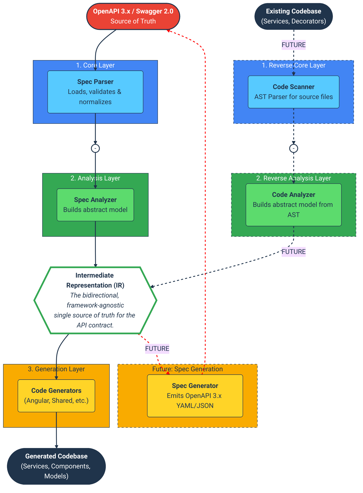

# cdd-web-ng

[](https://opensource.org/licenses/MIT)
[](https://github.com/offscale/cdd-web-ng/actions/workflows/tests_and_coverage.yml)
[](https://codecov.io/github/offscale/cdd-web-ng)
[](https://spec.openapis.org/oas/v3.2.0)
[](https://swagger.io/specification/v2/)

**OpenAPI ↔ Angular**

`cdd-web-ng` is an advanced, spec-compliant code generator that transforms OpenAPI (3.0, 3.1, 3.2) and Swagger (2.0)
specifications into fully-featured Angular client SDKs. It goes beyond simple client generation, creating services,
models, and even a complete CRUD administrative UI with deep respect for the nuances of the API contract.

## Key Features

This generator is built to handle real-world, complex API definitions with a focus on correctness, extensibility, and
reliability.

### 🚀 Exhaustive OpenAPI 3.2.0 Compliance

While many generators only cover the basics, `cdd-web-ng` is designed to correctly implement even the most complex and
esoteric parts of the modern OpenAPI specification. If it's in the spec, we support it.

- **Complex Schemas & Polymorphism:** Full support for `discriminator` mapping (explicit and implicit), `allOf`
  compositions, `oneOf`/`anyOf` unions, and `readOnly`/`writeOnly` filtering (generating distinct request vs. response
  models).
- **JSON Schema 2020-12 Support:** Handles OAS 3.1+ keywords like `$dynamicRef`, `dependentSchemas`, `dependentRequired`,
  `unevaluatedProperties`, `unevaluatedItems`, `patternProperties`, `propertyNames`, `additionalProperties`,
  `minProperties`/`maxProperties`, `contains`/`minContains`/`maxContains`, `if`/`then`/`else`, `not`, `const`,
  `prefixItems` (tuples), and boolean schemas (`true` / `false`).
- **Nullable (OAS 3.0):** Maps `nullable: true` to `| null` in generated TypeScript and preserves the nullable hint for
  round-trip OpenAPI output.
- **Advanced Serialization:**
    - **XML:** Full support for the `xml` object, including `nodeType`, namespaces, prefixes, attribute wrapping, and XML media types (`application/xml`, `application/*+xml`, `text/xml`) across parameters and bodies.
    - **Multipart:** Nested `multipart/mixed` and `multipart/form-data` with specific header encodings, including
      `style`/`explode` handling for per-part Encoding Objects.
- **Streaming:** Native support for sequential media types like `application/json-seq`, structured-suffix variants
  (e.g. `application/geo+json-seq`), `application/x-ndjson`, and `text/event-stream` (Server-Sent Events), including
  NDJSON/JSON-Seq request body serialization.
    - **SSE Parsing:** Fetch-based event stream parsing that honors `data`, `event`, `id`, and `retry` fields, comment
      lines, BOM handling, and optional `contentSchema`/`contentEncoding` decoding of payloads.
    - **Custom Sequential JSON:** JSON-based media types (e.g. `application/vnd.acme+json`) that provide `itemSchema`
      are treated as JSON Lines by default, enabling streaming even when the media type is not registered.
    - **Binary Modeling:** Distinguishes raw binary (`contentMediaType` → `Blob`) from encoded binary
      (`contentEncoding` → `string`), while keeping text and XML media types as `string`.
- **Form-URL-Encoding:** WHATWG-compliant `application/x-www-form-urlencoded` encoding (spaces as `+`) with per-field
  encoding hints, plus contentEncoding-aware preprocessing for urlencoded bodies.
- **Querystring Content:** RFC3986 percent-encoding for non-form media types, with encoding hints preserved in
  reverse-generation for `in: querystring` parameters.
- **Request Body Media Types:** Typed support and explicit `Content-Type` handling for `text/*`, `application/*+xml`,
  and binary payloads like `application/octet-stream` (schema-less binaries default to `Blob` responses).
    - **Media Type Specificity:** When multiple content entries exist, request/response type inference prefers the most
      specific media type (e.g. `application/json` over `application/*`) and favors JSON-suffix types over text.
- **Content Negotiation Defaults:** Prefers the most specific media type when wildcards are present and widens return
  types to unions when multiple 2xx responses define distinct schemas (even with the same media type).
- **Response Headers:** Special-case `Set-Cookie` multi-value parsing and `Link`/`linkset`/`linkset+json` decoding, with XML header metadata round-trip and full inline Header Object preservation for reverse generation.
- **Reference Resolution:** Resolves `$ref` for parameters, request bodies, and responses before analysis and generation, including context-aware relative refs inside external documents (using `$self`/`$id` bases), percent-decoding URI fragments for JSON Pointer resolution (e.g. `{}` in `operationRef` paths), multi-document component schemas for type generation, and preloads external `operationRef` targets so link resolution works across multi-document OADs.
- **Runtime Features:** Implements dynamic
  [Runtime Expressions](https://spec.openapis.org/oas/v3.2.0.html#runtime-expressions) for resolving **Links**
  and **Callbacks** directly from HTTP responses, including `operationRef` → `operationId` resolution when available
  (including webhook targets and component-level links), with percent-decoded JSON Pointer segments and parameter omission on evaluation failure.
  Also exports typed **Callbacks**/**Webhooks** registries (including component-level
  definitions for round-trip reverse generation) and a `WebhookService` helper for downstream consumers.
- **Strict Parameter Serialization:** Correctly implements `style` and `explode` logic for all parameter locations (
  path, query, header, cookie), including "deepObject" and space/pipe delimited styles, plus RFC6570 comma delimiter
  handling for non-exploded arrays/objects and path-safe `allowReserved` encoding that preserves percent-encoded
  triples. Also includes `querystring` content serialization for `application/x-www-form-urlencoded`.
- **Content-Based Parameters:** Honors `content` media types for query/header/cookie parameters (including
  `application/x-www-form-urlencoded` value serialization) and preserves per-property `encoding` plus
  `contentEncoding`/`contentMediaType` hints for round-trip OpenAPI generation.
- **Example Fidelity:** Prefers `serializedValue`/`externalValue` when emitting example tags for non-JSON media types,
  preserving exact wire-format examples during reverse generation. Parameter and header examples are preserved as
  full Example Objects (`dataValue`, `serializedValue`, `externalValue`) for round-trip accuracy.
- **Component Registries:** Exposes reusable `components.headers` and `components.links` registries (alongside
  examples/mediaTypes/pathItems/parameters/requestBodies/responses) to keep reverse generation lossless even when
  component definitions are not referenced by paths. Link registries also preserve `x-` extensions for round-trip
  fidelity.
- **Reverse Schema Inference:** Detects discriminated unions from TypeScript unions with literal discriminants,
  emitting `oneOf` + `discriminator` mappings for `$ref` unions and `discriminator` hints for inline unions.
- **Extension-Safe Metadata:** Preserves `x-` extensions on `info`, `tags`, and `servers` while generating
  extension-friendly TypeScript metadata interfaces for lossless round-trip output.
- **Security Scheme URI References:** Resolves security schemes referenced by URI inside Security Requirement objects,
  preserving URI keys (including `./` shadowing) for round-trip fidelity, without breaking Swagger 2.0 compatibility.
- **Security Requirements Round-Trip:** Exports document-level security requirements alongside schemes so reverse
  OpenAPI generation preserves global security defaults.
- **Spec Validation:** Enforces OAS rules such as unique `operationId` values (including multi-document OADs),
  duplicate-parameter detection,
  parameter object shape checks, required parameter fields (`name`, `in`), tag name uniqueness, path-template
  parameter matching (including ACL-empty path items), template-brace validation for paths/servers, strict 3.2
  parameter constraints, server template-variable integrity (including empty server overrides), reserved
  header-parameter ignores (`Accept`,
  `Content-Type`, `Authorization`), server variable defaults (including enum type checks), parameter
  location/style matrix validation, Header Object `schema`/`content` requirements, XML Object constraints
  (`nodeType`, `wrapped`, namespace IRIs), license name requirements, security scheme field requirements
  (OAuth2/OpenID TLS URLs, apiKey/http fields), `externalDocs` URI validation, response status-code key
  validation, **Response Object `description` enforcement** and **non-empty Responses Objects**, **component
  Path Item/Webhook operation validation**, response `Content-Type` header ignores, Encoding Object
  header/contentType/style constraints and media-type compatibility checks (including sequential `itemSchema`
  guards), Link Object runtime-expression validation (parameters/requestBody), Link server URL validation,
  Callback runtime-expression validation (including reusable components.callbacks), plus Link/Header/MediaType
  object consistency checks, and JSON Schema URI keyword validation (`$schema`, `$id`, `$anchor`, `$dynamicAnchor`,
  `$ref`, `$dynamicRef`).

### 📚 Legacy Swagger 2.0 Support

Don't leave your legacy APIs behind. `cdd-web-ng` includes a robust compatibility layer that works with Swagger 2:

- Maps legacy `collectionFormat` (csv, ssv, tsv, pipes) to modern `style`/`explode` serialization.
- Normalizes `definitions` and `securityDefinitions` to the OpenAPI 3.0 component model.
- Derives `servers` from Swagger 2.0 `host`/`basePath`/`schemes`, and maps `consumes`/`produces` to request/response media types.
- Ensures your legacy services utilize the same modern Angular features (Signals, Standalone Components) as your new
  ones.

### 🔌 Highly Extensible Architecture

The generator is designed from the ground up to be framework-agnostic, making it easy to add support for other web
frameworks like **React** or **Vue**.

This is achieved through a two-phase process:

1. **Analysis Phase:** The OpenAPI specification is parsed into a framework-agnostic **Intermediate Representation (IR)
   **. This IR (located in `src/analysis`) describes API operations, data models, validation rules, and UI components
   without any ties to Angular or any other technology.
2. **Emission Phase:** A framework-specific generator consumes the IR to produce source code. The current implementation
   targets Angular (`src/generators/angular`), but new generators for other frameworks can be easily added by consuming
   the same stable IR.



### ✅ Comprehensive Test Coverage

Reliability is paramount. The codebase is validated by a robust, multi-layered test suite to ensure every feature, from
core parsing to the generated UI, works as expected.

- **Unit Tests** (`00-core` to `50-emit-admin`) for core utilities, individual analyzers, and generator components.
- **End-to-End Tests** (`60-e2e`) that run the entire generation process on complex, in-memory OpenAPI specs and
  validate the output.
- **Generated Code Tests** (`70-generated-code`) that validate the _test files_ we generate.
- A dedicated **`90-final-coverage`** suite with `branch-coverage.spec.ts` ensures even the smallest logical branches
  are tested.

## Installation

```bash
git clone --depth=1 https://github.com/offscale/cdd-web-ng
cd cdd-web-ng
npm install
npm run build
npm install -g .
```

(I'll put it up on npmjs soon)

## Usage

The primary way to use the generator is through its command-line interface.

```bash
cdd_web_ng from_openapi --input <path-or-url-to-spec> --output <output-directory> [options]
```

### Options

| Option                   | Alias | Description                                                               | Default       |
| ------------------------ | ----- | ------------------------------------------------------------------------- | ------------- |
| `--config <path>`        | `-c`  | Path to a configuration JS file.                                          | `undefined`   |
| `--input <path>`         | `-i`  | Path or URL to the OpenAPI spec (overrides config).                       | _Required_    |
| `--output <path>`        | `-o`  | Output directory for generated files (overrides config).                  | `./generated` |
| `--framework <name>`     |       | Target framework. Currently supports `angular`.                           | `angular`     |
| `--admin`                |       | Generate a complete Angular Material admin UI for CRUD operations.        | `false`       |
| `--no-generate-services` |       | Disable generation of API services.                                       | `true`        |
| `--no-tests-for-service` |       | Disable generation of `.spec.ts` test files for services.                 | `true`        |
| `--dateType <type>`      |       | How to type `format: "date"` or `"date-time"`. Choices: `string`, `Date`. | `Date`        |
| `--enumStyle <style>`    |       | How to generate enums. Choices: `enum`, `union`.                          | `enum`        |

### Generated Service Options

Generated Angular service methods accept an `options` object that extends Angular `RequestOptions` and includes
server selection:

- `server?: number | string` - Selects a server by index or by matching `name` or `description`.
- `serverVariables?: Record<string, string>` - Overrides server template variables.

If an operation defines its own `servers`, that list is used for the request; otherwise the top-level servers apply.

### Reverse Generation (to_openapi)

`from_openapi` now writes OpenAPI snapshot files to the output directory:

- `openapi.snapshot.json`
- `openapi.snapshot.yaml`

Use these snapshots to reconstruct the spec:

```bash
cdd_web_ng to_openapi --file <output-directory> --format yaml > openapi.yaml
```

This reverse flow is snapshot-based today (intended for codebases generated by `cdd-web-ng`). If no snapshot is found,
`to_openapi` will fall back to parsing generated service files to reconstruct paths, operations, parameters, and media
types, and generated models to rebuild `components.schemas`. If those artifacts are missing, an AST-based TypeScript
scanner is used for hand-written clients; it recognizes `QUERY` and common non-standard HTTP methods (mapped to
`additionalOperations`). The AST scanner also understands JSDoc hints for `@see` (operation `externalDocs`),
`@operationId`, `@response` / `@responseSummary` (status-specific response metadata), `@param` (parameter descriptions),
`@paramSchema` (parameter schema overrides), `@paramExample` / `@requestExample` / `@responseExample` (examples for
parameters, request bodies, and responses),
`@server` (operation-level `servers`), `@security` (operation-level security requirements), `@x-*` extensions, and JSON
`@tag` hints for full Tag Object metadata (summary/description/parent/kind/externalDocs). JSON `@server` payloads can
also be used to set `name` and `variables` on Server Objects.
The AST scanner additionally recognizes `@querystring` JSDoc tags to emit `in: "querystring"` parameters with
content-based serialization (defaulting to `application/x-www-form-urlencoded`), including per-field encoding maps and
example preservation for reverse generation.
Generated services emit `@querystring` hints when querystring parameters are present, preserving this metadata even
when snapshots are unavailable.
When TypeScript signatures are available, the AST scanner infers request/response schemas from `Request`/`Response`
generic types (for Express-style handlers), `@Body()` parameter types, and method return types, emitting `$ref`
schemas when matching component models are present.

Fallback reverse generation now emits **OpenAPI 3.2.0** (or the original `openapi` version when `document.ts` is present)
and preserves **querystring** parameters using
content-based serialization (defaulting to `application/x-www-form-urlencoded`), and places non-standard HTTP methods
under `additionalOperations`. It also rehydrates metadata from generated helper files (`info.ts`, `servers.ts` /
`utils/server-url.ts`, `security.ts`, and `document.ts`) to restore `info`, `tags`, `externalDocs`, `servers`,
`components.securitySchemes`, `$self`, `jsonSchemaDialect`, and top-level `x-` extensions when available. Response header/link registries
(`response-headers.ts`, `links.ts`) are
also folded back into operation responses. Callback and webhook metadata from generated `callbacks.ts` / `webhooks.ts`
rehydrate full PathItem definitions (including runtime expressions and request/response content) when present, and a
best-effort `components` map is rebuilt for non-schema objects such as parameters, request bodies, responses, headers,
links, callbacks, and webhooks.
If `document.ts` is missing, `to_openapi` now infers a `$self` URI using the output directory (defaulting to a
`file://.../openapi.yaml` location) to provide a stable base URI for relative references.
Request-body encodings for `application/x-www-form-urlencoded` and `multipart/*` are now rehydrated (including
`encoding`, `prefixEncoding`, and `itemEncoding`), and multipart media-type overrides are preserved from generated
`MultipartBuilder` configs when snapshots are missing.

Reverse model reconstruction now maps tuple types to JSON Schema `prefixItems` (with `minItems`/`maxItems`, plus
rest-tuple support via `items`), converts multiple `@example` tags into JSON Schema `examples`, and supports
`@contentMediaType` / `@contentEncoding` / `@contentSchema` tags for binary payload metadata. Generated models also emit
JSDoc tags for validation keywords (`minimum`, `maximum`, `minLength`, `maxLength`, `pattern`, `format`, `multipleOf`,
`minItems`, `maxItems`, `uniqueItems`, `minProperties`, `maxProperties`) plus `@xml` metadata so `to_openapi` can
preserve these constraints. Additional JSON Schema 2020-12 keywords (`patternProperties`, `dependentSchemas`,
`dependentRequired`, `unevaluatedProperties`, `unevaluatedItems`) plus OAS discriminator metadata (`@discriminator`)
and schema identifiers (`$schema`, `$id`, `$anchor`, `$dynamicAnchor`) are now preserved via JSDoc tags as well.
Discriminator inference also covers inline (non-`$ref`) union variants when all variants share a const discriminator
property.
Schema-level `x-` extensions are emitted as `@x-...` tags on generated models and rehydrated during `to_openapi`
fallback for extension-safe round-tripping.
Literal TypeScript
unions now emit JSON Schema `const` values, and `null` unions are represented using `type: ["null", ...]` to align
with OAS 3.2.

Fallback reverse generation now also infers request/response schema references from generated method signatures
(`Observable<T>` return types and body parameter types), and emits `itemSchema` for sequential media types such as
`application/jsonl` and `text/event-stream` when possible.

Operation-level tags are preserved via generated JSDoc `@tags` hints, and top-level `tags` are reconstructed from
those hints when metadata is not present. Per-operation server overrides are
reconstructed from the generated `operationServers` constants inside service methods. Generated services now emit
JSDoc `@server`, `@security`, and `@x-*` tags on methods so `to_openapi` can restore operation servers, security
requirements, and extensions even when snapshots or HttpContext metadata are unavailable.

Generated services now emit JSDoc `@response` tags (status + optional media type), which the reverse pass
uses to restore status-specific responses when snapshots are missing. Services also emit `@operationId` tags so
round-tripped specs preserve the original operationId even when method names are camelCased.
Response Object summaries are preserved via `@responseSummary` tags (status + summary), keeping `summary` intact
when reconstructing operation responses without snapshots.
Example Objects for parameters, request bodies, and responses are preserved via `@paramExample`, `@requestExample`,
and `@responseExample` tags, ensuring example payloads survive fallback reverse generation. For non-JSON wire-format
examples, wrapped carriers like `{"__oasExample": {"serializedValue": "..."} }` or `{"__oasExample": {"externalValue": "..."} }`
preserve `serializedValue`/`externalValue` without collapsing back to `example` during `to_openapi`.
JSDoc `@param` descriptions are reused to restore parameter `description` fields and the requestBody description
when a body payload is present.

Operation-level `x-` extensions are restored from the generated HttpContext metadata (`EXTENSIONS_CONTEXT_TOKEN`)
to preserve extension-aware round-tripping for generated clients.

Components registries for `examples`, `mediaTypes`, reusable `pathItems`, `parameters`, `requestBodies`, and
`responses` are now emitted as `examples.ts`, `media-types.ts`, `path-items.ts`, `paths.ts`, `parameters.ts`,
`request-bodies.ts`, and `responses.ts`, and are rehydrated back into `components` during `to_openapi` when snapshots
are not present.

## Acknowledgement

This project extends upon foundational ideas for Angular client generation (`Services` only; no tests; no auto-admin;
limited OpenAPI spec implementation) from the MIT-licensed [ng-openapi-gen](https://github.com/ng-openapi/ng-openapi)
project. Thanks to [Tareq Jami (@Mr-Jami)](https://github.com/Mr-Jami).
